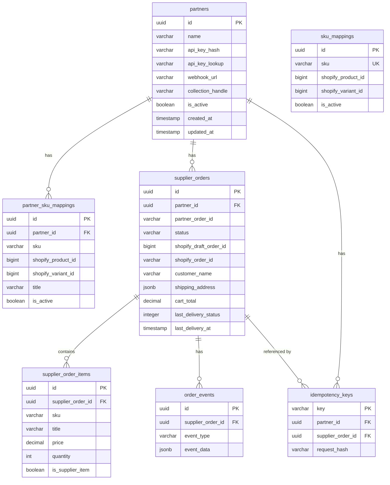

# B2B API Database Schema

Database: **b2bapi** (PostgreSQL). All tables live in schema **public**.

---

## Mermaid ER diagram (GitHub/GitLab)



---

## Entity relationship (overview)

```
┌─────────────────┐       ┌──────────────────────────┐       ┌─────────────────────────┐
│    partners      │       │   partner_sku_mappings   │       │      sku_mappings      │
├─────────────────┤       ├──────────────────────────┤       ├─────────────────────────┤
│ id (PK)         │◄──────│ partner_id (FK)          │       │ id (PK)                │
│ name            │       │ sku                       │       │ sku (unique)            │
│ api_key_hash    │       │ shopify_product_id        │       │ shopify_product_id      │
│ api_key_lookup  │       │ shopify_variant_id       │       │ shopify_variant_id     │
│ webhook_url     │       │ title, price, image_url  │       │ is_active              │
│ collection_handle│      │ is_active                │       └─────────────────────────┘
│ is_active       │       └──────────────────────────┘
└────────┬────────┘
         │
         │ 1:N
         ▼
┌─────────────────────────┐       ┌─────────────────────────┐
│    supplier_orders       │       │  supplier_order_items   │
├─────────────────────────┤       ├─────────────────────────┤
│ id (PK)                 │◄─────│ supplier_order_id (FK) │
│ partner_id (FK)          │  1:N  │ sku, title, price       │
│ partner_order_id         │       │ quantity, product_url   │
│ status                   │       │ is_supplier_item       │
│ shopify_draft_order_id   │       │ shopify_variant_id     │
│ shopify_order_id        │       └─────────────────────────┘
│ customer_name, customer_phone
│ shipping_address (JSONB) │       ┌─────────────────────────┐
│ cart_total, payment_status      │    idempotency_keys      │
│ payment_method           │       ├─────────────────────────┤
│ last_delivery_*           │       │ key (PK)               │
└────────┬─────────────────┘       │ partner_id (FK)         │
         │                          │ supplier_order_id (FK)  │
         │ 1:N                      │ request_hash           │
         ▼                          └─────────────────────────┘
┌─────────────────────────┐
│     order_events        │       ┌─────────────────────────┐
├─────────────────────────┤       │   schema_migrations    │
│ id (PK)                 │       ├─────────────────────────┤
│ supplier_order_id (FK)  │       │ version (PK)            │
│ event_type              │       │ dirty                   │
│ event_data (JSONB)      │       └─────────────────────────┘
└─────────────────────────┘
```

---

## Tables

### partners

| Column             | Type         | Nullable | Description |
|--------------------|--------------|----------|-------------|
| id                 | UUID         | NO (PK)  | Default uuid_generate_v4() |
| name               | VARCHAR(255) | NO      | Partner display name |
| api_key_hash       | VARCHAR(255) | NO      | Bcrypt hash of API key; UNIQUE |
| api_key_lookup     | VARCHAR(64)  | YES     | SHA256 hex for fast lookup; UNIQUE |
| webhook_url        | VARCHAR(500) | YES     | Optional URL for delivery/order webhooks |
| collection_handle  | VARCHAR(255) | YES     | Shopify collection handle for partner catalog |
| is_active          | BOOLEAN      | NO      | Default true |
| created_at         | TIMESTAMP    | NO      | Default CURRENT_TIMESTAMP |
| updated_at         | TIMESTAMP    | NO      | Default CURRENT_TIMESTAMP, trigger-updated |

**Indexes:** api_key_hash, api_key_lookup (partial WHERE NOT NULL), is_active.

---

### sku_mappings (global JafarShop SKU → Shopify)

| Column             | Type         | Nullable | Description |
|--------------------|--------------|----------|-------------|
| id                 | UUID         | NO (PK)  | Default uuid_generate_v4() |
| sku                | VARCHAR(255) | NO      | UNIQUE |
| shopify_product_id | BIGINT       | NO      | |
| shopify_variant_id | BIGINT       | NO      | |
| is_active          | BOOLEAN      | NO      | Default true |
| created_at         | TIMESTAMP    | NO      | |
| updated_at         | TIMESTAMP    | NO      | |

**Indexes:** sku, is_active.

---

### partner_sku_mappings (per-partner SKU → Shopify)

| Column             | Type         | Nullable | Description |
|--------------------|--------------|----------|-------------|
| id                 | UUID         | NO (PK)  | Default uuid_generate_v4() |
| partner_id         | UUID         | NO (FK)  | REFERENCES partners(id) ON DELETE CASCADE |
| sku                | VARCHAR(255) | NO      | UNIQUE(partner_id, sku) |
| shopify_product_id | BIGINT       | NO      | |
| shopify_variant_id | BIGINT       | NO      | |
| title              | VARCHAR(500) | YES     | |
| price              | VARCHAR(50)  | YES     | |
| image_url          | VARCHAR(500) | YES     | |
| is_active          | BOOLEAN      | NO      | Default true |
| created_at         | TIMESTAMP    | NO      | |
| updated_at         | TIMESTAMP    | NO      | Trigger-updated |

**Indexes:** partner_id, (partner_id, sku), is_active.

---

### supplier_orders

| Column                   | Type         | Nullable | Description |
|--------------------------|--------------|----------|-------------|
| id                       | UUID         | NO (PK)  | Default uuid_generate_v4() |
| partner_id               | UUID         | NO (FK)  | REFERENCES partners(id) ON DELETE RESTRICT |
| partner_order_id         | VARCHAR(255) | NO      | UNIQUE(partner_id, partner_order_id) |
| status                   | VARCHAR(50)  | NO      | Default 'INCOMPLETE_CAUTION'; Shopify-aligned |
| shopify_draft_order_id   | BIGINT       | YES     | |
| shopify_order_id         | VARCHAR(50)  | YES     | Shopify order name (e.g. "1040") |
| customer_name            | VARCHAR(255) | NO      | |
| customer_phone           | VARCHAR(50)  | YES     | |
| shipping_address         | JSONB        | NO      | Address object |
| cart_total                | DECIMAL(10,2)| NO      | |
| payment_status           | VARCHAR(50)  | YES     | |
| payment_method           | VARCHAR(50)  | YES     | |
| rejection_reason         | VARCHAR(500) | YES     | |
| tracking_carrier         | VARCHAR(100) | YES     | |
| tracking_number          | VARCHAR(255) | YES     | |
| tracking_url             | VARCHAR(500) | YES     | |
| last_delivery_status     | INTEGER      | YES     | Wassel status code (e.g. 170 = Delivered) |
| last_delivery_status_label| VARCHAR(255) | YES     | Human-readable label |
| last_delivery_waybill    | VARCHAR(255) | YES     | |
| last_delivery_image_url  | TEXT         | YES     | Proof-of-delivery URL |
| last_delivery_at         | TIMESTAMPTZ  | YES     | When last webhook updated |
| created_at               | TIMESTAMP    | NO      | |
| updated_at               | TIMESTAMP    | NO      | Trigger-updated |

**Indexes:** partner_id, status, partner_order_id, shopify_draft_order_id, shopify_order_id, payment_method.

---

### supplier_order_items

| Column             | Type         | Nullable | Description |
|--------------------|--------------|----------|-------------|
| id                 | UUID         | NO (PK)  | Default uuid_generate_v4() |
| supplier_order_id   | UUID         | NO (FK)  | REFERENCES supplier_orders(id) ON DELETE CASCADE |
| sku                | VARCHAR(255) | NO      | |
| title              | VARCHAR(500) | NO      | |
| price              | DECIMAL(10,2)| NO      | |
| quantity           | INTEGER      | NO      | |
| product_url        | VARCHAR(500) | YES     | |
| is_supplier_item   | BOOLEAN      | NO      | Default false (true = from partner_sku_mappings) |
| shopify_variant_id | BIGINT       | YES     | |
| created_at         | TIMESTAMP    | NO      | |

**Indexes:** supplier_order_id, sku, is_supplier_item.

---

### idempotency_keys

| Column             | Type         | Nullable | Description |
|--------------------|--------------|----------|-------------|
| key                | VARCHAR(255) | NO (PK)  | Idempotency-Key header value |
| partner_id         | UUID         | NO (FK)  | REFERENCES partners(id) ON DELETE CASCADE |
| supplier_order_id   | UUID         | NO (FK)  | REFERENCES supplier_orders(id) ON DELETE CASCADE |
| request_hash       | VARCHAR(64)  | NO      | Hash of request body for replay detection |
| created_at         | TIMESTAMP    | NO      | |

**Indexes:** partner_id, supplier_order_id.

---

### order_events

| Column             | Type         | Nullable | Description |
|--------------------|--------------|----------|-------------|
| id                 | UUID         | NO (PK)  | Default uuid_generate_v4() |
| supplier_order_id   | UUID         | NO (FK)  | REFERENCES supplier_orders(id) ON DELETE CASCADE |
| event_type         | VARCHAR(100) | NO      | e.g. "created", "status_change" |
| event_data         | JSONB        | YES     | Optional payload |
| created_at         | TIMESTAMP    | NO      | |

**Indexes:** supplier_order_id, event_type, created_at.

---

### schema_migrations

Used by the migrate tool. Columns: **version** (PK), **dirty**.

---

## Relationships summary

| From                 | To                   | Relationship | FK / Constraint |
|----------------------|----------------------|--------------|------------------|
| partner_sku_mappings | partners             | N:1          | partner_id |
| supplier_orders       | partners             | N:1          | partner_id |
| supplier_order_items  | supplier_orders       | N:1          | supplier_order_id |
| idempotency_keys      | partners             | N:1          | partner_id |
| idempotency_keys      | supplier_orders       | N:1          | supplier_order_id |
| order_events          | supplier_orders       | N:1          | supplier_order_id |
| supplier_orders        | (partner_id, partner_order_id) | UNIQUE | per-partner idempotency |

---

## Order status values (Shopify-aligned)

- `INCOMPLETE_CAUTION` – draft / payment pending  
- `UNFULFILLED` – paid, not yet shipped  
- `FULFILLED` – shipped  
- `COMPLETE` – delivered  
- `CANCELED` – cancelled  
- `REJECTED` – rejected by supplier
